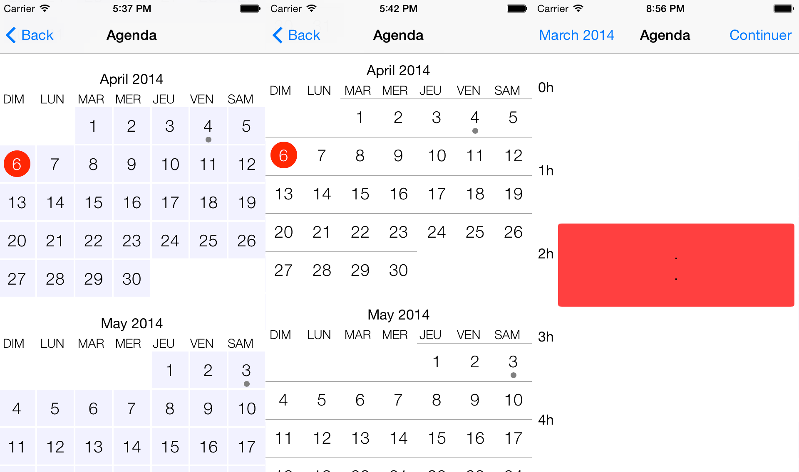

Calendar iOS
==================
[](http://twitter.com/leverdeterre)
[](https://github.com/leverdeterre/CalendarIOS7/blob/master/LICENSE)
[](https://github.com/leverdeterre/CalendarIOS7)


Calendar iOS is a very simple calendar/date picker component for your iOS apps based on UICollectionView and 2 layouts.

Day cells styles
---------------------------------------------------


## Changes
---------------------------------------------------
v 0.0.3 
	fix section number (number of months between two dates)
	update app localization	
v 0.0.2 
	Implementation of horizontal scrollDirection
	
v 0.0.1 
	Draft version

Supported iOS & SDK Versions
---------------------------------------------------

* Earliest supported deployment target - iOS 6.0

Creating a CalendarViewController
---------------------------------------------------


```objc
    CALAgendaViewController *agendaVc = [CALAgendaViewController new];
    agendaVc.calendarScrollDirection = UICollectionViewScrollDirectionHorizontal;
    agendaVc.agendaDelegate = self;
    [agendaVc setFromDate:fromDate];
    [agendaVc setToDate:toDate];
    #Select cell style
	agendaVc.dayStyle = CALDayCollectionViewCellDayUIStyleIOS7;
```

Delegation : CALAgendaCollectionViewDelegate
---------------------------------------------------


```objc
- (void)agendaCollectionView:(CALAgendaCollectionView *)agendaCollectionView didSelectItemAtIndexPath:(NSIndexPath *)indexPath selectedDate:(NSDate *)selectedDate;
```


```objc
- (BOOL)agendaCollectionView:(CALAgendaCollectionView *)agendaCollectionView canSelectDate:(NSDate *)selectedDate;
```


```objc
- (void)agendaCollectionView:(CALAgendaCollectionView *)agendaCollectionView didSelectItemAtIndexPath:(NSIndexPath *)indexPath startDate:(NSDate *)startDate endDate:(NSDate*)endDate;
```

Other protocols : CALgendaEvent
---------------------------------------------------
If events are availble, cell can be customize to present this state.
The calendar view controller can get a array of events.
Events have just to implement this protocol.

```objc
@protocol CALgendaEvent <NSObject>

- (NSDate *)eventStartDate;
- (NSDate *)eventEndDate;
- (NSString *)eventName;

@end
```


TODOS
---------------------------------------------------

- Improve genericity and customization of cells,
- Hours selection is a draft version .. so i'have to finish it :)


